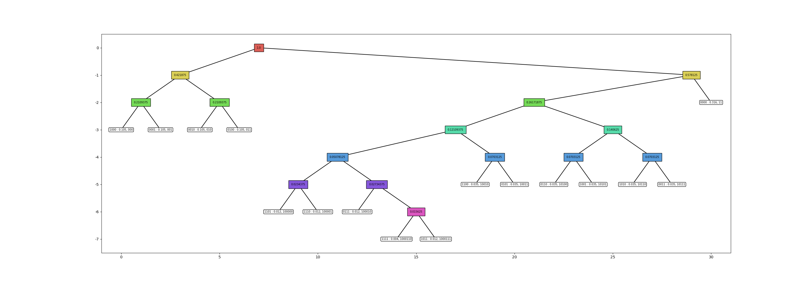
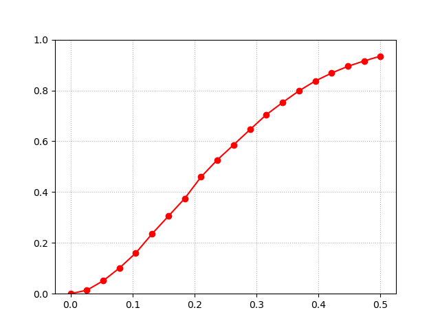

### How to install
1. python 3.7
```sh
conda create -n DigitalCommunications_23_fall_porject_1 python=3.7.15
activate DigitalCommunications_23_fall_porject_1
conda install pytorch==1.10.1 torchvision==0.11.2 torchaudio==0.10.1 cudatoolkit=11.3 -c pytorch -c conda-forge
conda install matplotlib
conda install seaborn
```

# huffman tree result



# simulation result (100회의 평균)

